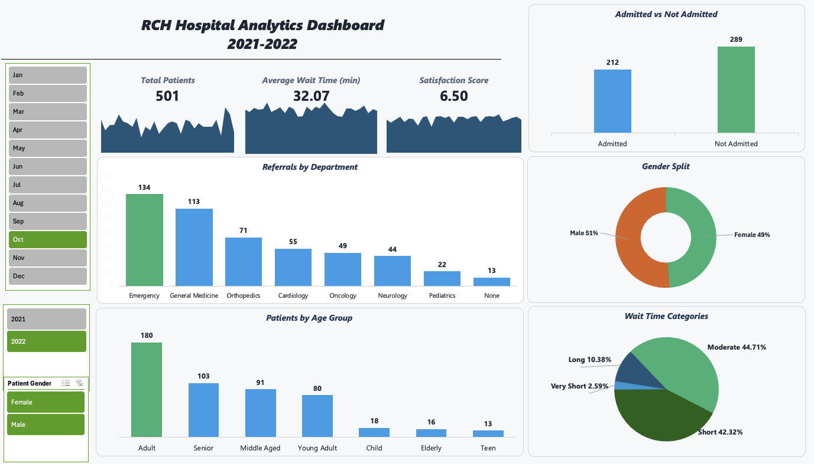

# RCH Hospital Analytics Dashboard (2021–2022)

---

## Project Overview  
This project presents an **interactive hospital analytics dashboard** built in Microsoft Excel.  
The dashboard provides actionable insights into **patients, admissions, wait times, referrals, and demographics**, simulating real-world healthcare reporting for hospital administrators.  

---

## Objectives  
- Track **total patients** across months and years.  
- Measure **average wait times** to identify bottlenecks.  
- Monitor **patient satisfaction scores**.  
- Compare **admitted vs. non-admitted patients**.  
- Analyze **referrals by department**.  
- Study **patient demographics** (gender & age groups).  
- Categorize **wait times** (Very Short, Short, Moderate, Long).  

---

##  Tools & Skills Used  
- **Microsoft Excel**  
  - Pivot Tables & Pivot Charts  
  - GETPIVOTDATA for KPI Cards  
  - Slicers for interactivity (Month, Year, Gender)  
  - Custom formatting for professional look  
- **Analytics Skills**  
  - KPI design  
  - Data cleaning & transformation  
  - Dashboard storytelling  

---

## Dashboard Features  

### KPI Cards  
- **Total Patients:** `501`  
- **Average Wait Time:** `32.07 minutes`  
- **Satisfaction Score:** `6.50 / 10`  

### Admission Status  
- Admitted: `212`  
- Not Admitted: `289`  

### Referrals by Department  
- Highest: Emergency (`134`), General Medicine (`113`)  
- Lowest: Pediatrics (`22`), None (`13`)  

### Gender Split  
- Male: `51%`  
- Female: `49%`  

### Patients by Age Group  
- Adults: `180`  
- Seniors: `103`  
- Middle Aged: `91`  
- Young Adults: `80`  
- Children, Elderly, Teens: `<20 each`  

### Wait Time Categories  
- Moderate: `44.71%`  
- Short: `42.32%`  
- Long: `10.38%`  
- Very Short: `2.59%`  

---

## Key Insights  
✔️ **Emergency Department** has the highest referrals, indicating pressure on critical care.  
✔️ **Adults dominate** the patient population, followed by Seniors and Middle Aged.  
✔️ **87% of patients** experience Short/Moderate wait times → shows efficiency but still scope to reduce.  
✔️ **Non-admissions > admissions**, suggesting most cases are outpatient.  
✔️ **Satisfaction score (6.5/10)** shows potential for service quality improvements.  
✔️ **Gender distribution is balanced**, ensuring unbiased hospital services.  

---

## How to Use  
1. Download and open **RCH-Hospital-Insights.xlsx**.  
2. Use **slicers** (Month, Year, Gender) to filter the dashboard.  
3. Explore KPIs and charts for insights.  

---

⭐ If you found this project insightful, don’t forget to **star this repo**!
